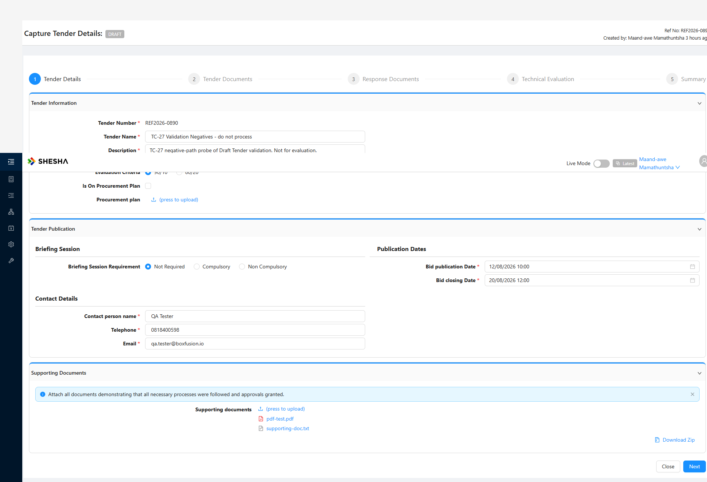

# Report: BID-SCM — TC-27 Draft Tender field and business-rule validation (NEGATIVE)

**Date:** 2026-08-03
**Plan:** test-plans/tender-process/bid-supply-chain-management.md
**Cases:** TC-27
**Method:** driven live via Playwright MCP (no spec — this is a first-pass exploration)
**Environment:** QA — `https://pd-supplychainmanagement-adminportal-qa.shesha.app`
**Login:** Maanda-awe / 123qwe · view mode **Latest**
**Form:** `Shesha.SupplyChainManagement/capture-tender-details v46`
**Tender:** **REF2026-0890** — throwaway draft, never submitted, left with a valid date pair
**Result:** PARTIAL — **11 of 14 probes correctly enforced, 3 defects.** Every *date and format* guard on this
form is correctly enforced; the defects are in validation *feedback*: probe 11 (Next silently disabled on a valid
form), probe 12 (row silently rejected, the real message went only to the console) and probe 13 (Evaluation
Criteria + Briefing Session Requirement gate Next but are not marked `*`). Two claims I raised during this TC
were withdrawn the same day — both were my testing errors, not app faults.

## Why this TC exists

TC-01 has always populated this wizard *correctly*, so not one of its guards had ever been exercised. ADO #57475
documents no validation expectation at all (its steps toggle Step 1 fields and stop at Next), so every assertion
here derives from the form's own `*` markers and ordinary business sense.

## Results

| # | Probe | Result |
|---|---|---|
| 1 | Next on the untouched form | ✅ disabled |
| 2 | Telephone = `not-a-phone-abc` | ✅ *"Invalid phone number format. Enter a valid phone number (10-15 digits)"* |
| 3 | Email = `notanemail` | ✅ *"Invalid email format. Enter a valid email address"* |
| 4 | Publication date in the past | ✅ **not selectable** — past day cells are `.ant-picker-cell-disabled` |
| 5 | Closing date before publication | ✅ **not selectable** — the closing picker greys out every day **up to and including** the publication date (publication 12/08 → 03–12 Aug disabled, 13+ selectable) |
| 6 | Closing after publication | ✅ accepted |
| 7 | **Publication moved after an existing closing date** | ✅ **handled**: the picker **auto-clears the invalid closing date**, shows *"This field is required"* and **disables Next** |
| 8 | Max Points `-10` / `0` | ✅ *"maxPoints must be minimum 1"*, row not added |
| 9 | Minimum score `6` (Total 10, then Total 50) | ✅ *"must be minimum 10"* — a **fixed** floor, not derived from Total |
| 10 | Minimum score `150` (Total 100) | ✅ *"must be maximum 100"* |
| 11 | Criteria total **50** with a valid minimum | 🔴 **Next silently disabled** — valid form, no error, no hint |
| 12 | Criteria total pushed to **150** | 🔴 **row silently rejected**; the real message went to the **console** |
| 13 | Which fields gate Next | 🔴 **Evaluation Criteria + Briefing Session Requirement — neither marked `*`** |
| 14 | Is the Supporting Document mandatory? | ✅ **No** — TC-01's plan was wrong; corrected |

## ⚠️ WITHDRAWN — "a tender that closes before it opens"

**This report originally led with a Medium–High defect: publication 10/08 with closing 06/08, committed
(`PUT Rfx/Crud/Update` → 200) and surviving a reload. It is withdrawn — the app is correct and the fault was in
how I drove it.**

**The precise cause (narrowed by two rounds of the manual re-testing):**

1. I first set a **valid** pair by typing — publication 05/08, closing 06/08.
2. I then **cleared the publication field with Playwright's `fill('')`**, which writes the input value directly and
   leaves AntD's React state stale.
3. Only then did I type 10/08 into the emptied field.

**It is step 2 that manufactured the invalid state, not the typing.** A manual re-test of *typing with Enter*
using the same dates and times and the app **correctly refused**: the closing date does not save and Next stays
greyed out. So neither the picker path nor the typing path allows this — it took a programmatic field clear.

**Driven the way a user drives it — day cell → hour → OK — every direction is properly enforced:**

| Action via the picker | Result |
|---|---|
| Open closing picker with publication = 12/08 | Days **03–12 Aug greyed out**; 13+ selectable |
| Set publication to 12/08 while closing = 06/08 | **Closing is auto-cleared**, marked *"This field is required"*, **Next disabled** |
| Set a valid pair (12/08 → 20/08) | Accepted, Next enabled |

Manual verification reproduced the correct behaviour — *"the next button is disabled and the dates before the
publication date are greyed out"* — and asked the question that found my error: **did I click OK after selecting
the date and time?** I had not. A second manual round then ruled out typing as the cause too.

> 🔑 **Standing harness rule: never set these date fields programmatically.** No `.fill()`, no `.fill('')` to
> clear, no `pressSequentially`. Drive the panel — **day cell → hour → OK** — exactly as the spec's
> `pickAntDateTime` helper does; its comment already warned that `.fill()` "does NOT commit to React state". To
> change a date, reopen the picker and pick again rather than emptying the input.
>
> **A programmatic clear cost a false Medium–High defect and left invalid data in a draft.** It is the same root
> cause as the `pressSequentially` append problem below: these inputs only behave when driven as a user drives
> them.

**One residual observation, not raised as an issue:** the invalid pair *was* accepted by the server
(`PUT Rfx/Crud/Update` → 200) once the client sent it, so there is no server-side ordering check. It is **not
reachable through the UI** by any means we have found, and nothing in the test cases requires such a check —
recorded here only so the trail is complete.

## What this TC actually establishes

**Every guard on this form works.** The remaining observations are behaviour ADO explicitly prescribes:

- A disabled Next when a mandatory field is missing is what **#57475** describes.
- The criteria **total-100** rule is required by **#57475**; the only quibble is that its message
  (*"Total score cannot exceed 100…"*) goes to `console.error` rather than the screen — not a documented
  expectation, so not raised.
- The **Supporting Document** is mandatory **and enforced** (Next stays disabled until attached).

## Step 4 rule, established

The criteria's Max Points must total **exactly 100**: below it Next stays disabled, above it the row is refused.
The minimum score is bounded to a fixed **10–100**. Because the total is pinned at 100, `minimum ≤ total` holds
by accident — so an **unwinnable tender cannot currently be created**, which is the right outcome for the wrong
reason. If the total-must-be-100 rule is relaxed, add an explicit `minScore <= totalScore` check.

## Harness lessons (cost two invalid probes)

1. 🔴 **`pressSequentially` APPENDS into AntD date inputs** — a field became `10/08/2026 09:0005/08/2026 09:00`,
   which silently invalidated the first attempt at probe 7. **Clear with `fill('')` first.**
2. **`.fill()` alone does not commit a date to React state** (the spec drives the picker panel via
   `pickAntDateTime`); typing + `Enter` does commit.
3. **Ctrl+A navigates the whole page away**, losing the unsaved form. Never use it to clear a field here.
4. Date input `id`s are **regenerated per page load** — locate by label.
5. **Uploads DO work via the MCP file chooser** (`StoredFile/Upload` → 200 ×3). An earlier "the upload didn't
   register" reading was my own wrong DOM query — this form family uses **div-based tables**, so
   `querySelectorAll('.ant-upload-list-item')` and `table tbody tr` both return nothing. **Use the a11y
   snapshot.** Nearly filed a false defect on this.
6. A "disabled Next" is not evidence of the rule you are testing. Both times I saw one I had to run a **control
   with a known-valid value** to find out what was really blocking it — the first min-score reading and the first
   date reading were both wrong until I did.

## Test data

| Tender | State | Note |
|---|---|---|
| **REF2026-0890** | **Draft / Capture Tender Details** | Named *"TC-27 Validation Negatives - do not process"*. **Left with a VALID date pair** (publication 12/08/2026 10:00, closing 20/08/2026 12:00) — the invalid pair created by typing was corrected via the picker. 3 criteria totalling 100, minimum score 60, 2 supporting docs + 1 bid document. Never submitted. |

**No bug doc** — the one raised for this TC was deleted, since every item in it turned out to be documented
behaviour or a testing error of mine.
