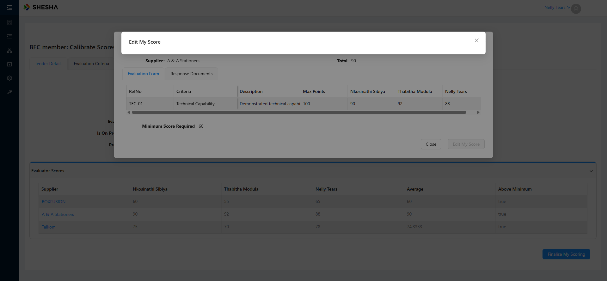

# ⚠️ UNCONFIRMED: "Edit My Score" rendered an empty dialog — possibly an unhealthy environment, NOT a defect

> ## ⚠️ NOT A CONFIRMED DEFECT — do not report until retested
>
> **Logged as High, then immediately called into question when the QA site went into a
> continuous-loading state and would not let anyone log in.** A form-config request failing at **preflight** with
> `net::ERR_FAILED` is precisely what a **degraded API or gateway** produces — no missing form is needed to explain
> it.
>
> **Supporting evidence for the environment explanation — now strong:**
> 1. During this same stretch one of my own `browser_navigate` calls to `/login` **timed out at 60 s** before
>    succeeding on a retry.
> 2. Immediately afterwards logins failed for **every** user — the site loaded continuously.
> 3. **The QA site then went fully DOWN.**
>
> A sequence of degrade → refuse logins → outage, with my run sitting inside it, makes infrastructure by far the
> more likely explanation.
>
> **The one point that argues the other way:** at the moment of the failure, every *other*
> `FormConfiguration/GetByName` call on the same page, to the same API origin, **succeeded** — including
> `bec-calibrate-score v11` itself. A blanket outage would be expected to affect those too. So this is genuinely
> unresolved, not simply dismissed.
>
> **Precedent for caution:** the 2026-07-30 "Disapprove hangs" bug was chased for five days and ultimately
> attributed to a likely degraded network, never reproduced. See
> `2026-07-30-disapprove-hangs-metadata-404.md`.
>
> ### How to settle it
> 1. **Retest when the site is healthy** — same path, as Nelly / Nathi / Thabitha, on REF2026-0939 and on one of
>    the older tenders (REF2024-0612 / 0671 / 0607).
> 2. **Decisive check that does not depend on the environment:** look for a form named
>    **`tender-wf-edit-calibration-score`** under *Configurations → Forms*. **If the form does not exist, this is a
>    real defect** regardless of site health. If it exists and is published, the empty dialog was almost certainly
>    infrastructure.
>
> **Severity held at "unconfirmed" until one of those is done.** Everything below records what was observed, not a
> confirmed fault.

| Field | Value |
|---|---|
| **Logged** | 2026-08-03 |
| **Project** | PD Bid Management (`projects/bid-management`) |
| **App / Env** | Supply Chain Management Admin Portal — **QA** (`https://pd-supplychainmanagement-adminportal-qa.shesha.app`) |
| **Severity** | ⚠️ **UNCONFIRMED — not reportable.** Logged High, then withdrawn pending retest: **the QA site went fully DOWN shortly after this run**, having already refused logins and timed out a navigation beforehand. The observed failure mode (form-config request failing at preflight) is consistent with that |
| **Reproducibility** | 1/1, in a window when the environment was **provably degrading** — so effectively untested |
| **Stage / Form** | BID Management → **Calibrate Scores** → `bec-calibrate-score v11`, *"BEC member: Calibrate Scores and Finalise Scoring"* |
| **Role** | BEC **Member** — **Nelly / 123qwe** (evaluator, not the Secretariat) |
| **Tender** | **REF2026-0939** (`run-ms61n9fs`, 90/10), status *BEING EVALUATED* — **not modified** |
| **ADO** | **#60824** — the case that had **no test case in this plan** until today |
| **Plan / TC** | **TC-35** |

## Root cause — the dialog's form config never loads

Captured from the browser console at the moment *Edit My Score* is clicked:

```
[ERROR] Access to fetch at 'https://pd-supplychainmanagement-api-qa.shesha.app/api/services/Shesha/
        FormConfiguration/GetByName?name=tender-wf-edit-calibration-score&module=Shesha.SupplyChainManagement'
        from origin 'https://pd-supplychainmanagement-adminportal-qa.shesha.app' has been blocked by CORS policy:
        Response to preflight request doesn't pass access control check:
        No 'Access-Control-Allow-Origin' header is present on the requested resource.

[ERROR] Failed to load resource: net::ERR_FAILED
        …/FormConfiguration/GetByName?name=tender-wf-edit-calibration-score&module=Shesha.SupplyChainManagement
        TypeError: Failed to fetch
```

So the form **`tender-wf-edit-calibration-score`** cannot be fetched and the dialog renders empty.

**Note for dev — this is probably not really a CORS problem.** Every other `FormConfiguration/GetByName` call on the
same page, to the same API origin, succeeds (`bec-calibrate-score v11` itself loads that way). A single endpoint
failing *preflight* usually means the server threw on that specific request and the error response carried no CORS
headers, which the browser then reports as a CORS failure. **The likely underlying cause is that the form
configuration `tender-wf-edit-calibration-score` does not exist (or is not published) in this environment.** Worth
checking that first — the fix is probably a missing form, not a CORS policy.

Also visible: the successful form-config requests on this page carry an `&md5=…` cache parameter; this failing one
does not.

## Evidence



Measured state of the dialog: `.ant-modal-body` **innerText length 0**, **0 inputs**, **0 edit icons**, one icon
button (the close X), **no Save**, no spinner. Waited 3 s and re-measured — unchanged, so it is not a slow load.

## What DOES work on this page (the rest of ADO #60824 passes)

| ADO step | Result |
|---|---|
| BID Management menu exposes **Evaluate Tenders, Calibrate Scores, TenderType Documents, Suppliers** | ✅ exactly as documented |
| Open the item from the calibrate list | ✅ *"BEC member: Calibrate Scores and Finalise Scoring"* page opens (`bec-calibrate-score v11`) |
| Tabs **Tender Details** / **Evaluation Criteria** | ✅ both present, read-only |
| *"The BEC member should be able to view the scores for Suppliers from other BEC Members"* | ✅ **Yes** — the Evaluation Form table shows a column per evaluator (Nkosinathi Sibiya 90, Thabitha Modula 92, Nelly Tears 88 on A & A Stationers), and the **Evaluator Scores** panel lists all three evaluators per supplier with **Average** and **Above Minimum** |
| Click the Supplier link → dialog to view/edit own score | ✅ opens, with Total and Minimum Score Required 60 |
| Click **Edit My Score** | 🔴 **empty dialog — blocked here** |
| Edit icon → Points Awarded + Comments editable | 🔴 unreachable |
| **Finalise My Scoring** | ⬜ not attempted (would finalise without any calibration having been possible) |

## Deviations from the case (minor, worth noting)

- The case says **"Double click on the item you want to calibrate"**; the list renders **single-click anchors** to
  `bec-calibrate-score?id=…`.
- The case calls the button **"Finilise Scoring"** / *"Finalize"*; the app says **"Finalise My Scoring"**.
- The case's navigation is *Evaluate Tenders*; the app also provides a dedicated **Calibrate Scores** page
  (`tenders-to-finalise-score v8`, titled *"Tenders to Finalise Score"*), which is the natural entry point.

## Expected

A BEC Member can open *Edit My Score*, adjust **Points Awarded** and **Comments** for a supplier, save, and
finalise — per ADO #60824. At minimum, a form that fails to load must show an error rather than an empty dialog.

## Why this was never caught before

TC-10/TC-11 cover the **BEC Secretariat's** side of calibration (*Begin Calibration*, *Monitor calibration and
finalise scoring*), so calibration appeared covered. **#60815** states that Begin Calibration *"should send items
to **both** BEC Secretariate to monitor calibration of scores **and BEC Members to calibrate scores**"* — a
parallel branch. Every run to date passed *through* calibration without any member ever adjusting a score, which
is precisely the half that is broken.

## Test data

**REF2026-0939** left untouched at *BEING EVALUATED*, still listed under Calibrate Scores. Three other items are
also available there (REF2024-0612, REF2024-0671, REF2024-0607 — older, not ours) if a second data point is
wanted.
