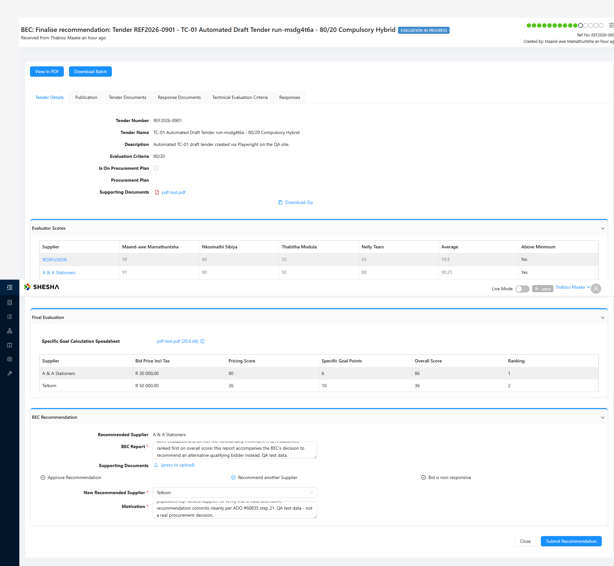

# BUG: Long free text in the BEC Report / Motivation makes "Recommend another Supplier" fail with a SILENT 500

> **✅ ROOT CAUSE ISOLATED 2026-08-03 by a controlled 3-attempt experiment on one tender.** The decision is not
> broken and the failure is not intermittent — **the free-text length is the trigger**, and the only thing the user
> sees is nothing at all.

| Field | Value |
|---|---|
| **Logged** | 2026-08-03 |
| **Project** | PD Bid Management (`projects/bid-management`) |
| **App / Env** | Supply Chain Management Admin Portal — **QA** (`https://pd-supplychainmanagement-adminportal-qa.shesha.app`) |
| **Severity** | **Medium–High** — a documented decision silently discards a valid submission, with no message, no field limit and no counter |
| **Reproducibility** | **Deterministic. 4/4**: long text failed on REF2026-0901, twice on REF2026-0879, and (2026-07-30) on REF2026-1122. Short text succeeded **2/2** |
| **Stage / Form** | BEC: Finalise recommendation — `tender-wf-finaliserecommendation-details`, decision **Recommend another Supplier** |
| **Role** | BEC Secretariat — **ThabisoM / 123qwe**, view mode **Latest** |
| **Endpoint** | `PUT /api/dynamic/Shesha.SupplyChainManagement/RfxEvaluation/Crud/Update` |
| **ADO** | **#60835 steps 18–21** |
| **Plan / TC** | **TC-34** |

## The experiment — same tender, same supplier, only the text length changed

Driven on **REF2026-0879** (90/10, three qualifying suppliers, A & A Stationers pre-recommended, Telkom selected
as the alternative). Nothing else varied between attempts:

| # | BEC Report | Motivation | Result |
|---|---|---|---|
| 1 | **286 chars** | 235 chars | 🔴 `PUT … RfxEvaluation/Crud/Update` → **500**, no advance, **nothing on screen** |
| 2 | **286 chars** (identical retry, no edits) | 235 chars | 🔴 **failed again** — request fired (confirmed via resource timing: 3 PUTs total), still on the page |
| 3 | `Report` — **6 chars** | `Better price` — 12 chars | ✅ **committed**, redirected to My Items, tender advanced |

**Attempt 2 is the important one.** An identical retry also failed, which **rules out** the "intermittent write,
retry succeeds" explanation. Only shortening the text changed the outcome.

**End state after attempt 3:** REF2026-0879 → **ADJUDICATE IN PROGRESS**, at *Capture outcome from the BAC*, with
**Telkom** recorded as the recommendation.

## Probable limit: 255 characters on the BEC Report

Across all four failures the **BEC Report exceeded 255**; in both successes it was far under:

| Tender | BEC Report | Motivation | Result |
|---|---|---|---|
| REF2026-0901 | 288 | 236 | 500 |
| REF2026-0879 (×2) | 286 | 235 | 500 |
| REF2026-0879 | 6 | 12 | ✅ |
| REF2026-0901 (manual verification) | 6 | 22 | ✅ |

Note that **Motivation was under 255 in every failing case (235–236)**, so the BEC Report —
`technicalEvaluation.recommendationSupportingComments` — is the likely column, with a classic
`nvarchar(255)`-style limit.

**Outstanding to pin the exact threshold** (needs one more tender at this stage): submit with BEC Report at 255
and at 256, Motivation short, and see which side fails.

## The two defects

1. 🔴 **No client-side limit.** The textarea has no `maxlength`, no character counter and no validation — the user
   types freely and the app accepts the input right up to Submit.
2. 🔴 **The failure is completely silent.** After the 500: no toast, no notification, no `.ant-alert-error`, no
   inline field error, no spinner, the words "error"/"failed" nowhere in the page text, **Submit still enabled**,
   the selected supplier still shown, the page unmoved. **A user would reasonably believe the recommendation was
   saved.** It was not — the previous recommendation stands.

ADO **#60835 step 21** requires the submit to *"flag the newly recommended supplier as recommended and display the
captured motivation on the upcoming steps"*. With long text it does neither, and says nothing.

## Expected

1. Enforce the limit **in the form** — `maxlength` plus a visible counter — so it cannot be exceeded.
2. If the server rejects a write for any reason, **show the user a message**. A silent 500 on a procurement
   decision is the worst possible outcome for an audit trail.
3. Ideally raise the limit: a BEC report is a substantive justification and 255 characters is a sentence or two.

## Claims retracted along the way (all mine, same day)

1. ❌ *"On a normal tender this decision cannot be used at all."* It works with short text.
2. ❌ *"The only input that succeeds is an invalid one (a non-bidder)."* Telkom committed fine.
3. ❌ *"A supplier that has an evaluation row hits a DB constraint; a non-bidder doesn't"* (2026-07-30). Telkom has
   an evaluation row and committed.
4. ❌ *"It is intermittent — a retry works."* An identical retry failed; only the length mattered.

## The picker itself is correct (ADO #60835 step 19)

| Search | Result |
|---|---|
| `Stationers` — current recommendation | **No data** ✅ |
| `Telkom` — qualifying, not recommended | **1 result** ✅, no duplication |
| `Vodacom` — a non-bidder | **No data** ✅ |

Datasource `FlattenedCompliantResponse`, filtered on `technicalEvaluationStatus == 1` and excluding the current
supplier — exactly the documented scope. The **×10 duplication does not occur here**, confirming it is specific to
the below-minimum state.

## Test data

| Tender | State |
|---|---|
| **REF2026-0879** | *Capture outcome from the BAC*, **Telkom** recommended (advanced by attempt 3). Consumed from the BEC stage |
| **REF2026-0901** | *Capture outcome from the BAC*, **Telkom** recommended. Both are now fixtures for TC-13 / TC-22 |
| REF2026-1122 | Where the first 500 was seen (2026-07-30) — same long-text pattern |

## Harness note

This is the second time today that **how the input was produced** determined the outcome — the first being AntD
date fields set with `fill()`. Here the trigger was **long QA prose in a length-limited field**. Standing rule:
**keep automated free text short (≤ 100 chars) unless the field length is being tested deliberately**, and treat
any silent failure as a possible input-shape artefact before reporting it as app behaviour.
See [[dispatch-crud-append-accumulation]] — Dispatch had the identical signature.
